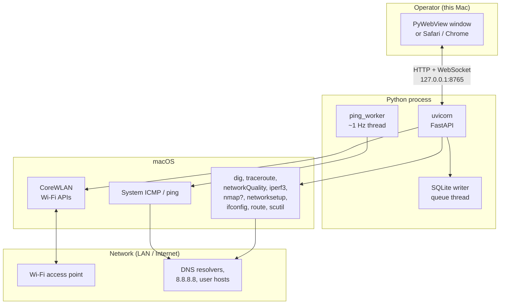
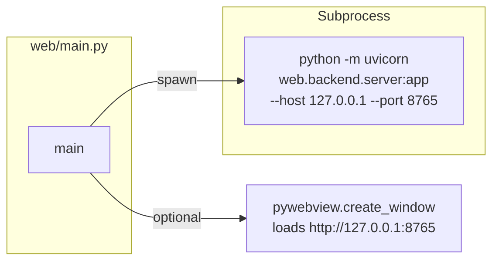
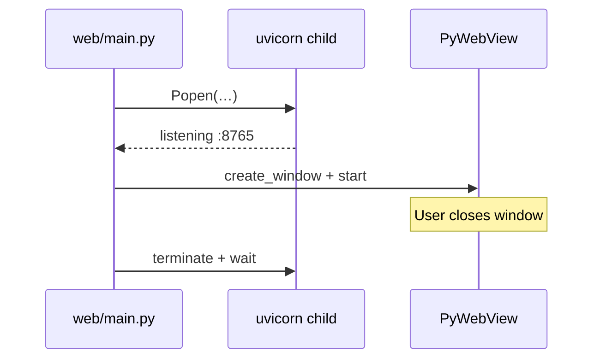
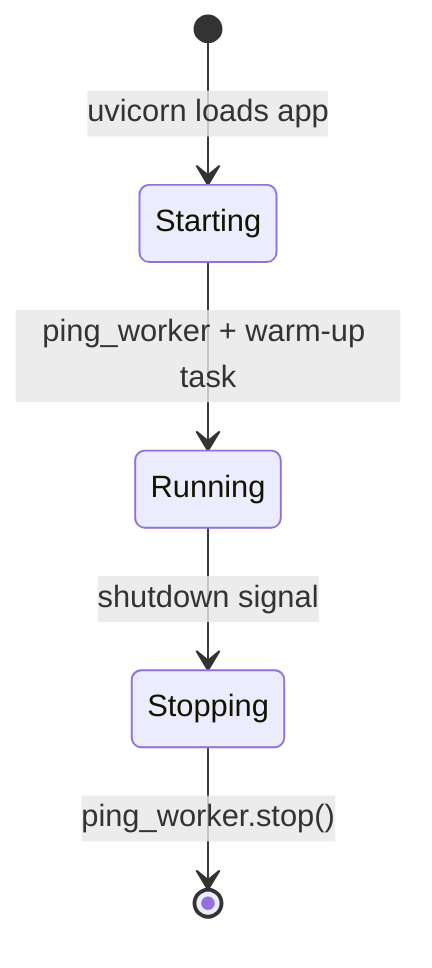
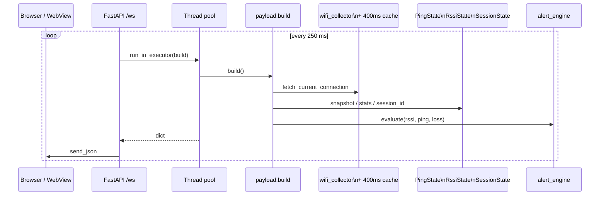
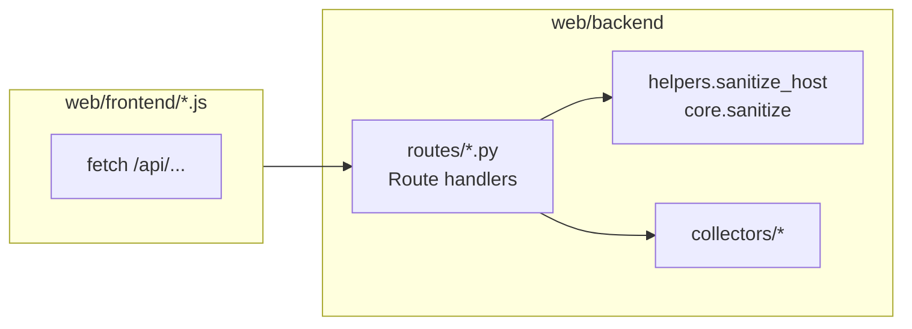
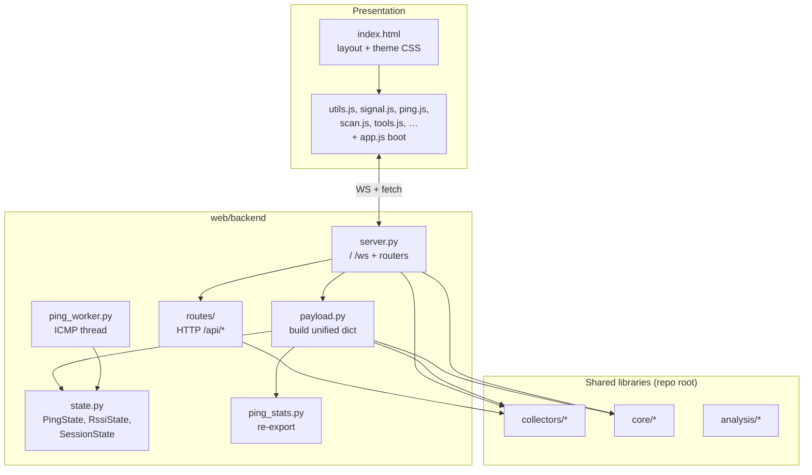
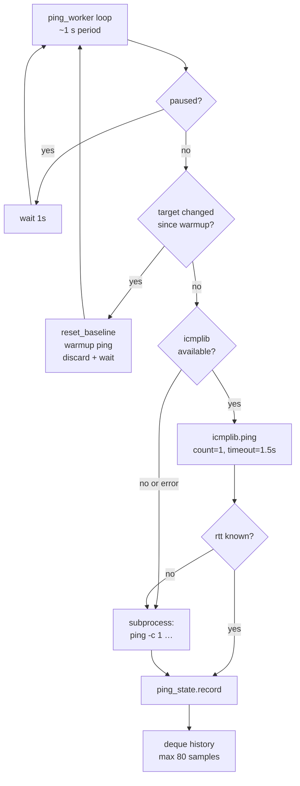
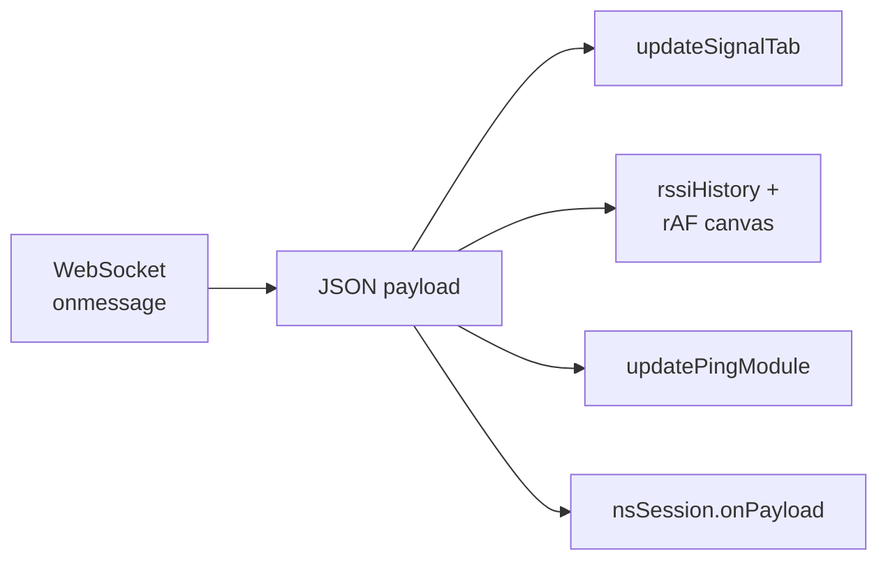
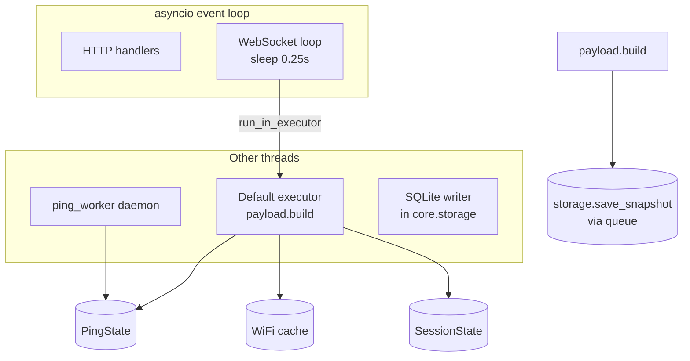

# NetScope — in-depth project guide

This document explains **how NetScope is put together**: processes, threads, network paths, and how data moves from macOS and Python to your screen. Use it as **context for an AI assistant** (paste whole-file or sections) when exploring behaviour, debugging, or extending the app.

For a shorter map and security notes, see [OVERVIEW.md](OVERVIEW.md). For setup and features, see [README.md](../README.md).

**Visuals** below use [Mermaid](https://mermaid.js.org/) diagrams. They render on GitHub, in GitLab, in many IDEs (including VS Code / Cursor with a Mermaid preview), and on [mermaid.live](https://mermaid.live) if you paste the fenced blocks.

**Version:** see repo root `VERSION` (currently aligned with this doc when both are maintained together).

---

## 1. What NetScope is (one paragraph)

NetScope is a **macOS-only** diagnostics tool that combines:

- **Live Wi‑Fi telemetry** from Apple’s **CoreWLAN** (signal, noise, PHY, channel, scan list), with **scutil** fallbacks where documented in collectors.
- A **continuous ICMP latency** stream to a configurable target (default `8.8.8.8`), using **icmplib** when available and the system **`ping`** binary as fallback. The worker can be **paused** from the UI/API.
- **On-demand tools**: DNS comparison (`dig`), `networkQuality`, `iperf3`, `traceroute`, interface snapshots, consolidated **network info** (gateway, DNS, proxy, public IP, Wi‑Fi details), optional **`nmap`** presets, and a **WAN segment** check (parallel short `traceroute` + `ping` to infer LAN vs ISP latency).
- **Optional customer sessions**: SQLite under `~/.netscope/sessions.db` stores periodic **stability** snapshots and **spike** event rows while a session is active.

The UI is a **single-page web app** (HTML/CSS/JavaScript) served by **FastAPI** on `127.0.0.1`. You can use an embedded **PyWebView** window or any browser — same origin, same WebSocket.

---

## 2. System context

Who talks to whom, at a high level:



**Important:** Nothing in this design is meant to be exposed to the public internet. The server binds to **localhost** only.

---

## 3. Processes and entry points

When you run `python web/main.py` (or `make run` from the repo root if configured):



- **Parent:** starts uvicorn, waits for TCP `:8765`, opens PyWebView (or prints “open in browser” if `webview` is missing), then on exit **terminates** the child process.
- **Child:** runs the FastAPI app: `GET /` (injects cache-bust token), `/static/*`, WebSocket `/ws`, REST `/api/*`, lifespan hooks.



---

## 4. Backend lifecycle (FastAPI `lifespan`)

On **startup**:

1. **`ping_worker.ensure_running()`** — starts the ~1 Hz ICMP thread.
2. **Wi‑Fi warm-up** — async task runs `fetch_current_connection()` once in a thread pool so the first WebSocket tick is not paying a cold CoreWLAN import/call on the hot path.

On **shutdown**, **`ping_worker.stop()`** joins the worker thread.



---

## 5. Two traffic patterns: live stream vs on-demand tools

### 5.1 Live WebSocket stream (~4 Hz)

The Signal tab (and shared metrics) consume a **single JSON object** pushed about **every 250 ms** on `WebSocket /ws`. Each tick, the server runs `payload.build()` in the **default thread-pool executor** (same pattern as `run_in_executor(None, …)`), then `send_json`.



**Wi‑Fi cache:** Inside `payload.py`, CoreWLAN is not called on every tick. A **~400 ms TTL** cache (lock-protected check + fetch + write) avoids hitting the driver at 4 Hz while still feeling “live”.

**Ping rate mismatch:** The **ping worker** runs at **~1 Hz** (after warmup on target change) and appends to `PingState`. The WebSocket runs at **~4 Hz** and **reads** the latest RTT and rolling history. The chart updates smoothly even though probes are once per second.

**Pause:** When ping is paused, the worker sleeps without recording samples; payload still flows with last-known history behaviour as implemented in the frontend.

### 5.2 On-demand HTTP APIs

Tools use **POST/GET** under `/api/...`. The front end calls `fetch()` when you open a tab or click an action — **not** over the WebSocket (except the live feed).



Every body that carries a **host** goes through **`helpers.sanitize_host`** → **`core.sanitize.normalize_diagnostic_host`**. Invalid hosts return **HTTP 400** before any subprocess runs.

**Static assets:** `app.mount("/static", StaticFiles(directory=web/frontend))` serves the whole frontend directory. A middleware sets **no-store** cache headers for `*.js` / `*.css` under `/static/`. `GET /` reads `index.html` and replaces `__STATIC_V__` with a fingerprint derived from `index.html` and all `*.js` mtimes under `web/frontend/` so embedded WebViews do not keep stale bundles.

---

## 6. Layered architecture (code modules)



**Why `ping_stats` is split:** **`collectors/ping_stats.py`** holds **`stats_from_rtt_history`** (no **icmplib**). **`web/backend/ping_stats.py`** re-exports it so **`payload`** stays import-safe if **icmplib** is absent. **`collectors/ping_collector`** imports the same helper for `PingSampler`. **Tests** cross-check collector vs web re-export (`tests/test_ping_collector.py`).

**`core/` today:** `sanitize` (metrics + **`normalize_diagnostic_host`**), `subproc`, `session`, `session_summary`, `storage`, `alerts`, `version`. No separate “health bus”; live signalling is the WebSocket payload + optional session snapshots.

---

## 7. Ping pipeline (detail)



`PingState` is fully **lock-protected**: the worker **writes**; `payload.build()` **reads** a snapshot `(current_rtt, history, target, seq)` under the same lock. **`seq`** increments on every `record()` so the UI can detect stale ticks.

**Spike detection (payload):** A slow **EMA** of RTT (`baseline_ms`, α=0.05) lives in `payload.py`. A **spike** is when the latest RTT is > 2× baseline, history has ≥10 valid samples, and RTT > 20 ms (filters trivial noise). **`reset_baseline()`** clears the EMA when the ping target changes (invoked from the worker’s warmup path).

---

## 8. Front-end modules (conceptual map)

Scripts are loaded in **`index.html`** in dependency order; **`app.js` runs last** and calls `connect()` (WebSocket) and `nsSession.initSession()`.

| File | Role |
|------|------|
| `utils.js` | Shared helpers, colours, DOM utilities |
| `signal.js` | Signal tab: metrics, RSSI canvas, alert banner |
| `ping.js` | Tools ping panel: Chart.js line, loss strip, target/pause, `updatePingModule` |
| `traceroute.js` | Traceroute panel rendering |
| `tools.js` | DNS, speed, iperf, interfaces, traceroute wiring; `window.nsTools` |
| `scan.js` | Wi‑Fi scan table, channel bars; globals `lastConnChannel`, `lastApName` |
| `netinfo.js` | Info tab: `GET /api/network/info` |
| `security.js` | Security tab: nmap UI, `GET /api/nmap/version`, `POST /api/nmap` |
| `session.js` | Customer session UI, pill, modal, review; `window.nsSession` |
| `ws.js` | WebSocket connect/reconnect; **`onData(d)`** dispatches to signal/ping/scan/session |
| `app.js` | Tab switching, lazy loads (e.g. net info, interfaces on first visit) |



- **RSSI:** rolling samples in JS; canvas redraw throttled with **`requestAnimationFrame`**.
- **Ping chart:** Chart.js with **`animation: false`** so ticks do not ease artificially.

---

## 9. Alerts and session snapshots

**Live banner:** `core.alerts.AlertEngine` runs inside **`payload.build()`** with **instantaneous** `ping_ms` (latest RTT), RSSI, and loss — responsive to current conditions.

**SQLite snapshots** (only when `session_id` is non-null in `SessionState`):

- **Stability rows** (`kind: stability`): throttled — **every 5 s** while alerts are not OK, **every 15 s** when OK. Stored fields are chosen to be review-friendly.
- **Spike rows** (`kind: spike`): when **`spike`** is true, **throttled to once per 5 s** so bursts do not flood the DB.

For snapshots, alerts are **re-evaluated** using **`rssi_avg10`** (or raw signal fallback) and **`avg_ms`** from the rolling ping history — so a single-probe spike does not create misleading warning rows in session review. Spike rows may include **`spike_rtt_ms`** for the instantaneous spike RTT.

---

## 10. Repository layout (text tree)

```
netscope/
├── collectors/          # CoreWLAN + subprocess tools: wifi, ping_stats, ping_collector, dns, speed,
│                        # traceroute, interface, iperf, network_info, nmap
├── core/                # sanitize (+ host validation), subproc, session, session_summary,
│                        # storage, alerts, version
├── analysis/            # thresholds, recommendations (no I/O)
├── web/
│   ├── main.py          # uvicorn subprocess + PyWebView
│   ├── backend/
│   │   ├── server.py    # FastAPI shell: /, /ws, static; mounts routes/
│   │   ├── routes/      # diagnostics, info, sessions, wifi
│   │   ├── helpers.py, models.py
│   │   ├── payload.py   # ~250 ms unified dict + session snapshot side effects
│   │   ├── state.py     # PingState, RssiState, SessionState
│   │   ├── ping_worker.py
│   │   └── ping_stats.py  # re-exports collectors.ping_stats
│   └── frontend/
│       ├── index.html   # SPA + theme CSS; script tags for all JS modules
│       ├── app.js       # tabs + boot
│       ├── ws.js, utils.js, signal.js, ping.js, scan.js, tools.js, …
│       └── vendor/      # Chart.js (often gitignored; downloaded by setup script)
├── tests/               # pytest; validate_all.py = optional live Mac
├── docs/                # INVENTORY.md, OVERVIEW.md, this file
├── Makefile             # convenience targets (e.g. run/stop) if present
├── requirements.txt
└── README.md
```

---

## 11. HTTP surface (reference)

| Method | Path | Role |
|--------|------|------|
| GET | `/` | Injects `__STATIC_V__`, serves `index.html` with no-store |
| — | `/static/*` | Frontend files + vendor JS |
| WS | `/ws` | Live ~250 ms JSON |
| POST | `/api/ping/target` | Set ICMP target; clears history |
| POST | `/api/ping/pause` | Toggle pause on background ping |
| GET | `/api/network/gateway` | Parse `route -n get default` for gateway IP |
| POST | `/api/wan/check` | Parallel short traceroute + ping to 8.8.8.8; WAN segment estimate |
| GET | `/api/network/info` | `network_info_collector.fetch()` |
| GET | `/api/wifi/scan` | Nearby APs + channel; merges current AP if scan missed it |
| POST | `/api/dns` | Body: host, `record_type` A or AAAA — multi-resolver compare |
| POST | `/api/speed` | `networkQuality`; optional `max_seconds` 20–90 |
| POST | `/api/traceroute` | Traceroute to validated host |
| GET | `/api/interfaces` | `interface_collector.snapshot()` |
| POST | `/api/iperf` | iperf3 (503 if binary missing) |
| GET | `/api/nmap/version` | Availability + version line |
| POST | `/api/nmap` | Bounded preset scan (`quick`, `services`, `safe_scripts`, `vuln`, `discovery`, `ssl`, `udp_top`) |
| POST | `/api/sessions` | Create session, set active |
| GET | `/api/sessions` | List last 100 sessions + snapshot counts |
| GET | `/api/sessions/active` | Current active session or null |
| POST | `/api/sessions/{id}/end` | End session, clear active if matching |
| PATCH | `/api/sessions/{id}` | Update notes and/or tags (allowed tags in `core.session.TAGS`) |
| GET | `/api/sessions/{id}/snapshots` | Merged stability + spike rows by timestamp |
| GET | `/api/sessions/{id}/summary` | Aggregate RSSI/ping/loss + alert counts |

---

## 12. Payload contract (WebSocket)

The authoritative field list lives in the **docstring** at the top of `web/backend/payload.py`. Summary:

- **Wi‑Fi:** `connected`, `signal` (RSSI), `rssi_avg10`, `rssi_stddev20`, `snr`, `phy_speed`, `ap_name`, `bssid`, `channel`, `band`, `phy_mode`, `wifi_gen`, `width`.
- **Ping:** `ping`, `seq`, `spike`, `baseline_ms`, `loss`, `min_ms`, `avg_ms`, `p50_ms`, `p95_ms`, `max_ms`, `jitter_ms`, `ping_target`, `ping_history`, `paused`.
- **Alerts:** `alerts`: `{ level, messages }` with `level` in `ok` / `warning` / `critical`.
- **Session:** `session_id` (string or null) — mirrors active session in backend state.
- **Meta:** `ts` (Unix time, seconds).

Treat **missing or null** fields as unknown — SSID/BSSID may be null without Location Services while RSSI still updates.

---

## 13. Threading and concurrency (mental model)



Rule of thumb: **ping writes** and **payload reads** are synchronized via `PingState`; **WiFi cache** uses its own lock; **session throttles** use `SessionState`; **SQLite** writes go through the storage queue thread.

---

## 14. Testing strategy

| Layer | How |
|--------|-----|
| Pure logic | `analysis/`, `core/sanitize`, `collectors/ping_stats` + `web/backend/ping_stats` re-export — **pytest** with mocks / Hypothesis |
| Collectors | Mocked subprocess / XML fixtures (e.g. nmap tests) |
| Full stack on a Mac | `python tests/validate_all.py` — live Wi‑Fi, ping, dig, route, etc. |
| CI | GitHub Actions workflow: **pytest**, **ruff**, **compileall**, **bandit** (see `.github/workflows/`) |

---

## 15. Further reading

- [INVENTORY.md](INVENTORY.md) — path → purpose (thin table)  
- [OVERVIEW.md](OVERVIEW.md) — condensed architecture + **security** section  
- [AGENTS.md](../AGENTS.md) — rules for contributors and automated agents  
- [README.md](../README.md) — install, run, feature list  

---

*NetScope — web app layout; FastAPI + WebSocket + optional PyWebView.*
