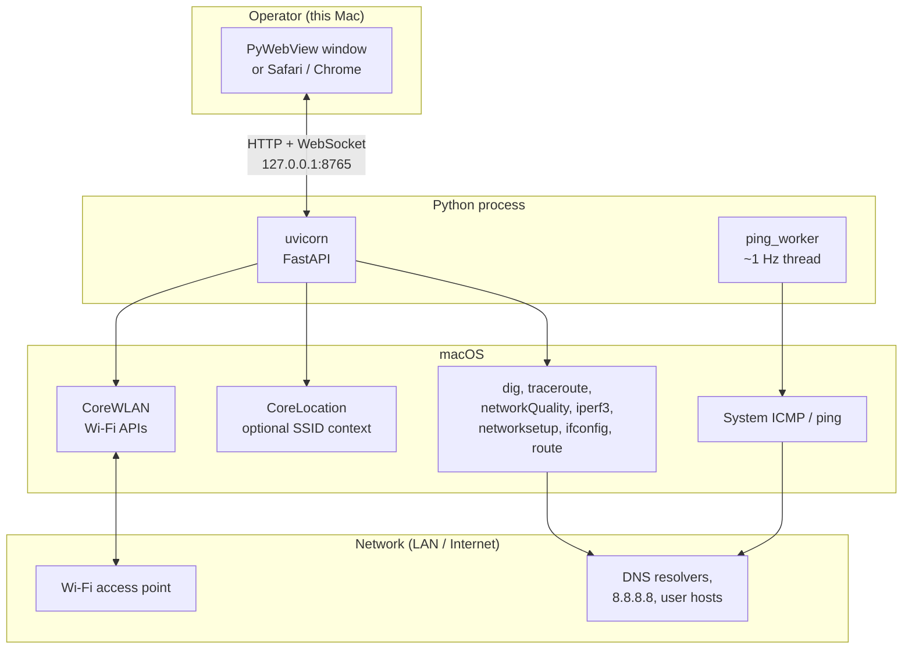
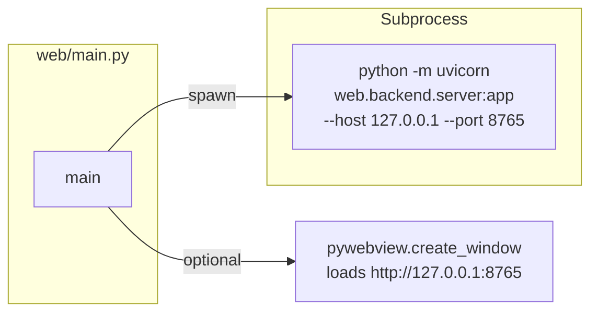
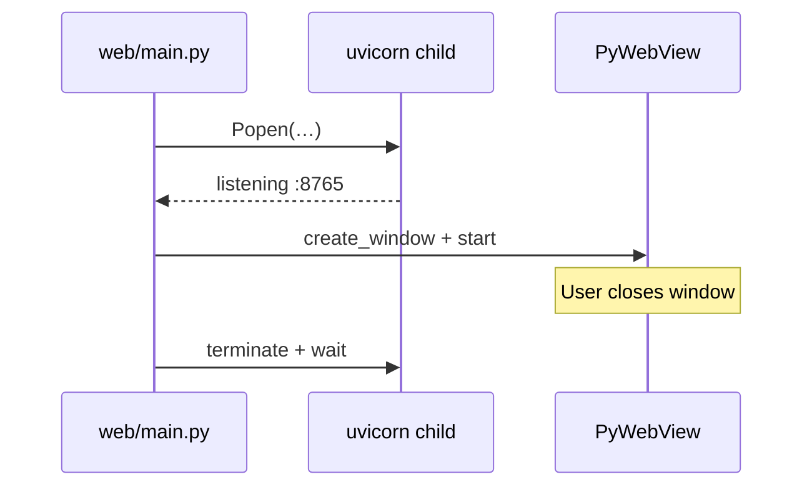
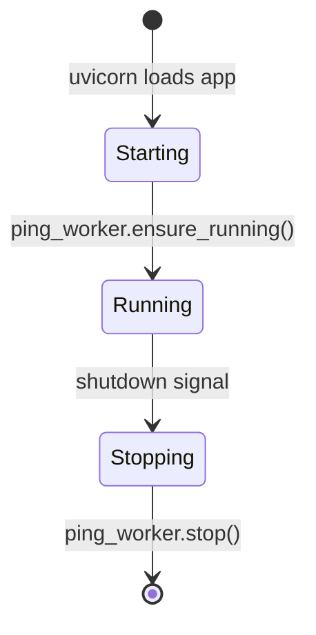
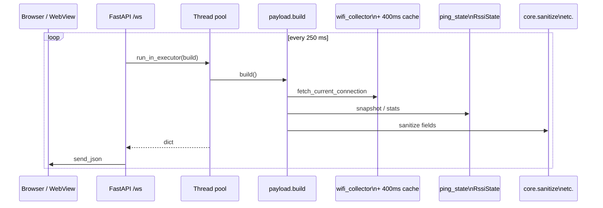
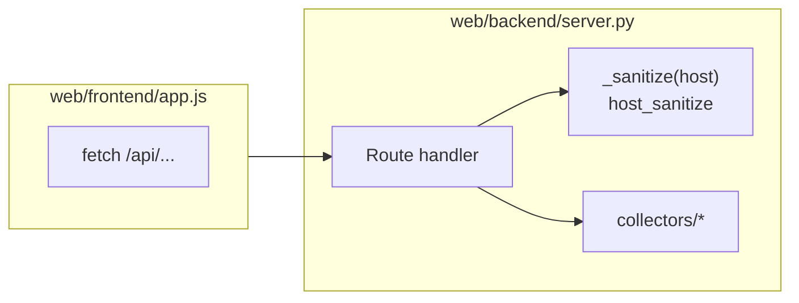
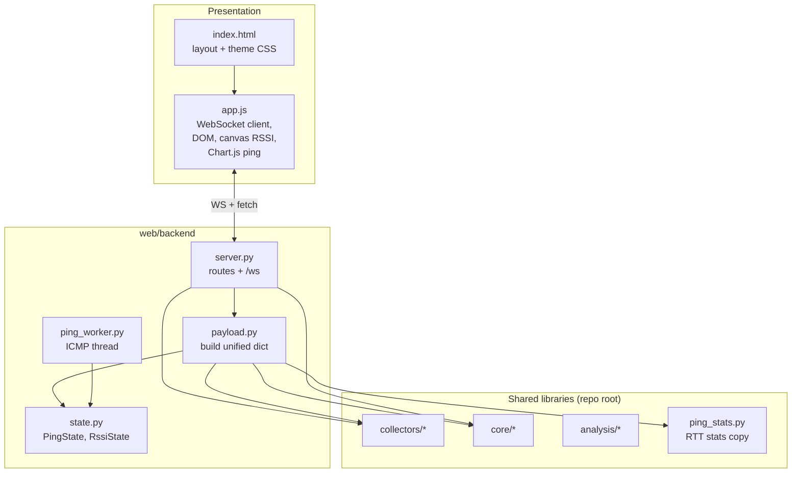
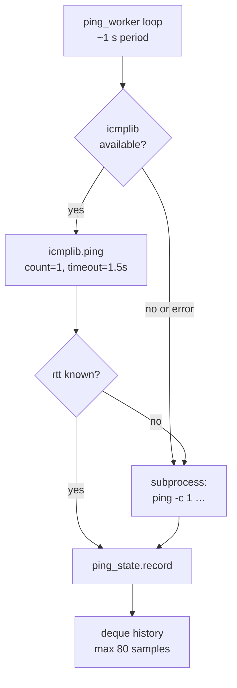
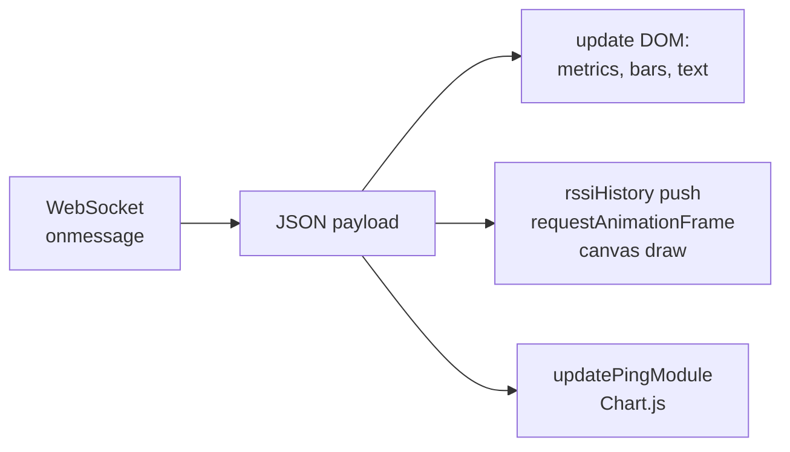
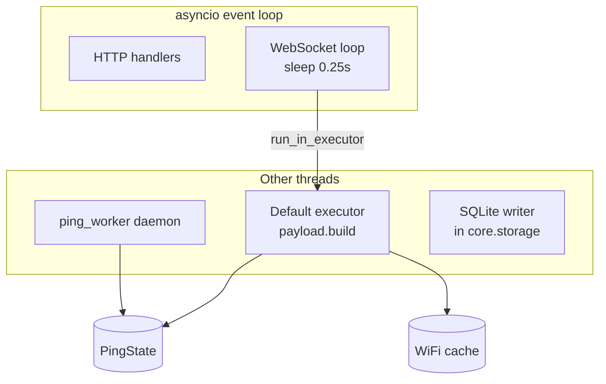

# NetScope — in-depth project guide

This document explains **how NetScope is put together**: processes, threads, network paths, and how data moves from macOS and Python to your screen. For a shorter map and security notes, see [OVERVIEW.md](OVERVIEW.md). For setup and features, see [README.md](../README.md).

**Visuals** below use [Mermaid](https://mermaid.js.org/) diagrams. They render on GitHub, in GitLab, in many IDEs (including VS Code / Cursor with a Mermaid preview), and on [mermaid.live](https://mermaid.live) if you paste the fenced blocks.

---

## 1. What NetScope is (one paragraph)

NetScope is a **macOS-only** diagnostics tool that combines:

- **Live Wi‑Fi telemetry** from Apple’s **CoreWLAN** (signal, noise, PHY, channel, scan list).
- A **continuous ICMP latency** stream to a configurable target (default `8.8.8.8`), using **icmplib** when available and the system **`ping`** binary as fallback.
- **On-demand tools**: DNS comparison (`dig`), `networkQuality`, `iperf3`, `traceroute`, and interface snapshots (`networksetup`, `route`, `ifconfig`).

The UI is a **single-page web app** (HTML/CSS/JavaScript) served by **FastAPI** on `127.0.0.1`. You can use an embedded **PyWebView** window or any browser — same origin, same WebSocket.

---

## 2. System context

Who talks to whom, at a high level:



**Important:** Nothing in this design is meant to be exposed to the public internet. The server binds to **localhost** only.

---

## 3. Processes and entry points

When you run `python web/main.py`:



- **Parent:** starts uvicorn, waits ~1.5s, opens PyWebView (or prints “open in browser” if `webview` is missing), then on exit **terminates** the child process.
- **Child:** runs the real FastAPI app: static files, WebSocket, REST-style `/api/*` routes, lifespan hooks.



---

## 4. Backend lifecycle (FastAPI `lifespan`)

On **startup**, the server starts the **ping worker** once. On **shutdown**, it stops that thread cleanly.



---

## 5. Two traffic patterns: live stream vs on-demand tools

### 5.1 Live WebSocket stream (~4 Hz)

The Signal tab (and shared metrics) consume a **single JSON object** pushed about **every 250 ms** on `WebSocket /ws`. Each tick, the server runs `payload.build()` in a **thread-pool executor** (so brief blocking work does not stall the asyncio event loop), then `send_json`.



**Wi‑Fi cache:** Inside `payload.py`, CoreWLAN is not called on every tick. A **~400 ms TTL** cache avoids hitting the driver at 4 Hz while still feeling “live”.

**Ping rate mismatch:** The **ping worker** runs at **~1 Hz** and appends to `PingState`. The WebSocket runs at **~4 Hz** and **reads** the latest RTT and rolling history. The chart therefore updates smoothly even though probes are once per second.

### 5.2 On-demand HTTP APIs

Tools (DNS, speed, traceroute, iperf, interfaces, Wi‑Fi scan, network info) use **POST/GET** under `/api/...`. The front end calls `fetch()` when you open a tab or click an action — **not** over the WebSocket.



Every body that carries a **host** goes through **`core.host_sanitize.normalize_diagnostic_host`** (via `_sanitize` in `server.py`). Invalid hosts return **HTTP 400** before any subprocess runs.

---

## 6. Layered architecture (code modules)



**Why `ping_stats.py` exists:** `collectors/ping_collector.py` imports **icmplib** at module import time. The WebSocket payload builder must stay import-safe if someone runs without icmplib, so **`web/backend/ping_stats.py`** duplicates the pure **`stats_from_rtt_history`** function. **Tests** assert both implementations stay identical.

---

## 7. Ping pipeline (detail)



`PingState` is fully **lock-protected**: the worker **writes**; `payload.build()` **reads** a snapshot `(current_rtt, history, target)` under the same lock.

---

## 8. Front-end update loop (conceptual)



- **RSSI:** rolling samples in JS; canvas redraw throttled with **`requestAnimationFrame`** for smooth animation without blocking the main thread.
- **Ping chart (Tools):** Chart.js is configured with **`animation: false`** so each tick replaces data without easing “fake” motion.

---

## 9. Repository layout (text tree)

```
netscope/
├── collectors/          # WiFi, ping sampler, DNS, interfaces, speed, traceroute, iperf, …
├── core/                # sanitize, storage, session, alerts, health_bus, host_sanitize
├── analysis/            # thresholds, recommendations (no I/O)
├── web/
│   ├── main.py          # uvicorn subprocess + PyWebView
│   ├── backend/
│   │   ├── server.py    # FastAPI, /ws, /api/*
│   │   ├── payload.py   # 250 ms unified dict
│   │   ├── state.py     # PingState, RssiState
│   │   ├── ping_worker.py
│   │   └── ping_stats.py
│   └── frontend/
│       ├── index.html
│       └── app.js
├── tests/               # pytest + validate_all.py (live Mac)
├── docs/                # OVERVIEW.md, this file
├── requirements.txt
└── README.md
```

---

## 10. HTTP surface (quick reference)

| Method | Path | Role |
|--------|------|------|
| GET | `/` | Serves `index.html` |
| — | `/static/*` | JS, assets from `web/frontend/` |
| WS | `/ws` | Live ~250 ms JSON |
| POST | `/api/ping/target` | Change ICMP target (validated host) |
| GET | `/api/network/info` | Consolidated network / public IP style info |
| GET | `/api/wifi/scan` | Nearby APs (CoreWLAN) |
| POST | `/api/dns` | DNS comparison |
| POST | `/api/speed` | `networkQuality` |
| POST | `/api/traceroute` | Traceroute |
| GET | `/api/interfaces` | Interface / gateway snapshot |
| POST | `/api/iperf` | iperf3 run |

---

## 11. Payload contract (WebSocket)

The authoritative field list and types live in the **docstring** at the top of `web/backend/payload.py`. In words:

- **Wi‑Fi:** `connected`, `signal`, SNR, PHY speed/mode/width, channel, band, SSID/BSSID (may be null), Wi‑Fi generation label.
- **Ping:** `ping`, `loss`, min/max/avg/jitter, `ping_target`, `ping_history` for charts.
- **RSSI smoothing:** `rssi_avg10`, `rssi_stddev20` derived in payload from `RssiState`.
- **Meta:** `ts` (Unix time).

The front end should treat **missing or null** fields as “unknown” — especially after removing Location permission, SSID/BSSID often disappear while RSSI may still update.

---

## 12. Threading and concurrency (mental model)



Rule of thumb: **no collector should assume it runs on the main thread**, but **all CoreWLAN and subprocess use from `payload.build()` is serialized per executor task**, and ping writes are serialized by `PingState`’s lock.

---

## 13. Testing strategy

| Layer | How |
|--------|-----|
| Pure logic | `analysis/`, `core/sanitize`, `ping_stats` ↔ `ping_collector` stats — **pytest** with mocks / Hypothesis |
| Collectors | Mocked subprocess output in tests |
| Full stack on a Mac | `python tests/validate_all.py` — live Wi‑Fi, ping, dig, route, etc. |
| CI | GitHub Actions: **pytest**, **ruff**, **compileall**, **bandit** |

---

## 14. Further reading

- [OVERVIEW.md](OVERVIEW.md) — condensed architecture + **security** section  
- [AGENTS.md](../AGENTS.md) — rules for contributors and automated agents  
- [README.md](../README.md) — install, run, feature list  

---

*NetScope **v1.0.0** — web-only layout (no legacy Tk desktop).*
